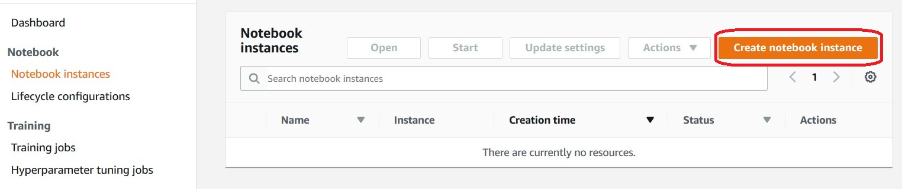
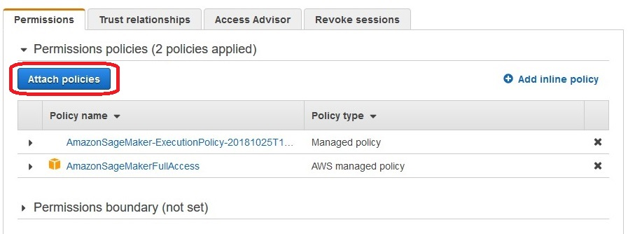
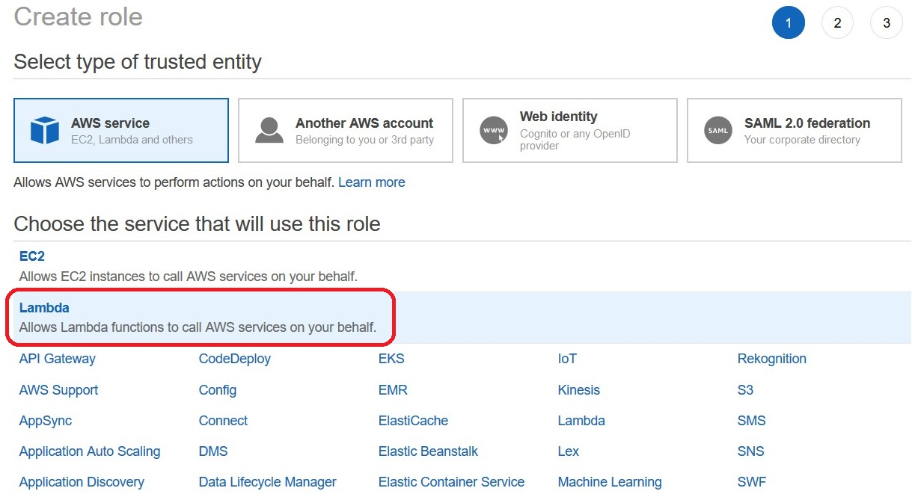
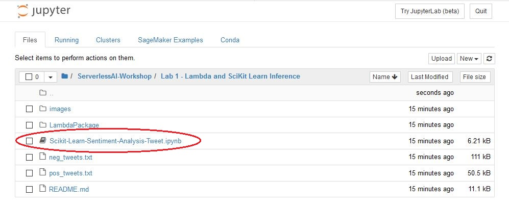
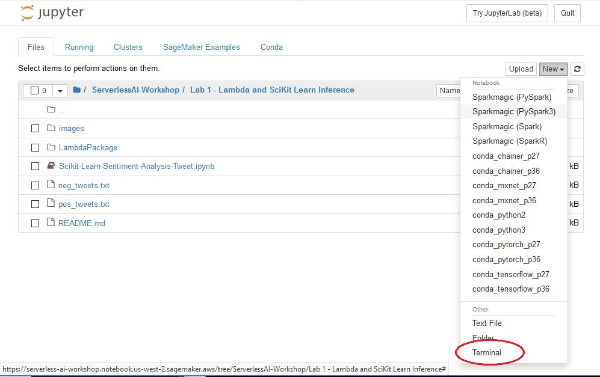
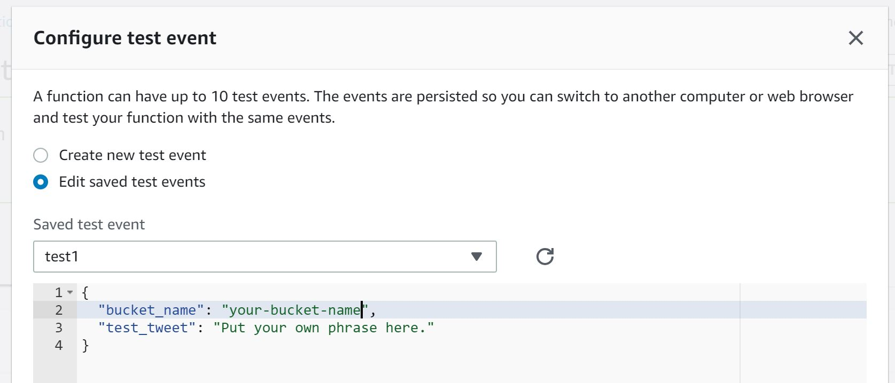
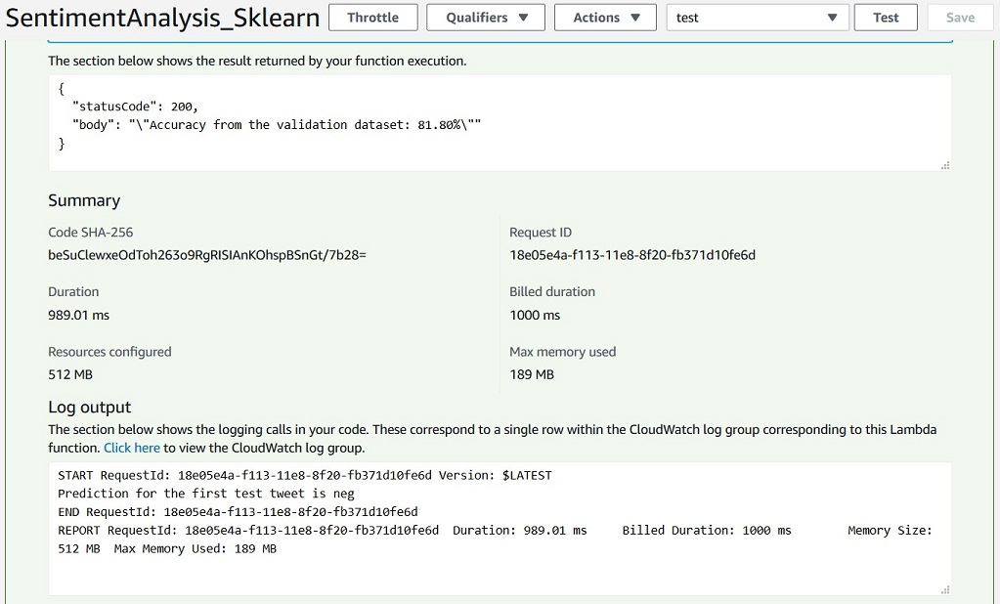

# Sentiment Analysis with Scikit Learn

In this workshop you will develop a simple sentiment analysis model using scikit learn's build-in linear regression algorithm.

## Prerequisites

### AWS Account
To complete this workshop you'll need an AWS Account with access rights to S3, Lambda, SageMaker, and to create AWS IAM roles. The code and instructions in this workshop assume only one participant is using a given AWS account at a time. If you try sharing an account with another participant, you'll run into naming conflicts for certain resources. You can work around these by appending a unique suffix to the resources that failto create due to naming conflicts. However, these instructions do not provide details on the changes required to make this work.

All of the resources you will launch as part of this workshop are eligible for the AWS free tier if your account is less than 12 months old. See the [AWS Free Tier page](https://aws.amazon.com/free/) for more details.

### Browser
We recommend you use the latest version of Firefox or Chrome to complete this workshop.

## Steps
1. Create a SageMaker lifecycle configuration

    Login to the AWS Console and navigate to [SageMaker](https://console.aws.amazon.com/sagemaker/). You can find SageMaker in the Machine Learning section or using the search box at the top of the console. The SageMaker Dashboard contains links to all major components: Notebook, Training, and Inference. Second on the Notebook list is "Lifecycle configurations". Click on that link.

    Lifecycle configurations are startup scripts that initialize your Jupyter notebook environments. They can be run once on creation or onevery notebook startup.

    Click on the orange button labelled "Create Configuration".

    Under "Scripts" click on "Create notebook".

    Name the lifecycle configuration ```serverless-ai-workshop-lc```. In the *Scripts* section click on **Create notebook**. Place your cursor on the line under the initial bash commands and paste the following:

    ```
    cd SageMaker
    git clone https://github.com/aws-samples/serverless-ai-workshop.git

    mkdir ServerlessAI-Workshop
    mv serverless-ai-workshop/Lab\ 1\ -\ Lambda\ and\ SciKit\ Learn\ Inference/ ServerlessAI-Workshop
    mv serverless-ai-workshop/Lab\ 2\ -\ SageMaker\ Batch\ Transform/ ServerlessAI-Workshop
    mkdir ServerlessAI-Workshop/Lab\ 1\ -\ Lambda\ and\ SciKit\ Learn\ Inference/LambdaPackage
    mkdir ServerlessAI-Workshop/Lab\ 2\ -\ SageMaker\ Batch\ Transform/LambdaPackage
    mv ServerlessAI-Workshop/Lab\ 1\ -\ Lambda\ and\ SciKit\ Learn\ Inference/lambda_function.py ServerlessAI-Workshop/Lab\ 1\ -\ Lambda\ and\ SciKit\ Learn\ Inference/LambdaPackage/
    mv ServerlessAI-Workshop/Lab\ 2\ -\ SageMaker\ Batch\ Transform/lambda_function.py ServerlessAI-Workshop/Lab\ 2\ -\ SageMaker\ Batch\ Transform/LambdaPackage/

    chown -R ec2-user.ec2-user ServerlessAI-Workshop/
    rm -rf serverless-ai-workshop

    wget https://www.mirrorservice.org/sites/dl.fedoraproject.org/pub/epel/7/x86_64/Packages/p/p7zip-16.02-10.el7.x86_64.rpm
    wget https://www.mirrorservice.org/sites/dl.fedoraproject.org/pub/epel/7/x86_64/Packages/p/p7zip-plugins-16.02-10.el7.x86_64.rpm

    rpm -U --quiet p7zip-16.02-10.el7.x86_64.rpm
    rpm -U --quiet p7zip-plugins-16.02-10.el7.x86_64.rpm

    rm p7zip-16.02-10.el7.x86_64.rpm
    rm p7zip-plugins-16.02-10.el7.x86_64.rpm

    ```

    The above commands do the following when the instance is created:
    - Download the code and necessary files from the workshop GitHub repo.
    - Organize the folder structure and place files in session folders.
    - Set write permission to the folders
    - Install 7-Zip which is required to compress lambda packages to their smallest size

1. Click on "Notebook instances". Click on "Create notebook instance" to create a Jupyter notebook using the lifecycle configuration created inthe previous step.

    

    - Take note of the region in which you are running SageMaker. You'll need to recall this region when you create an S3 bucket in the next step. For this workshop we're using Oregon: ```us-west-2```.
    - Name the instance as ```serverless-ai-workshop```.
    - Choose instance type such as ```ml.c5.4xlarge```.
    - Under IAM role choose "Create a new role"
            - Choose "Any S3 bucket"
            - Click "Create role" and take note of the newly created role.
    - No VPC
    - Choose lifecycle configuration, ```serverless-ai-workshop-lc```
    - No Custom Encryption
    - Click on **Create notebook instance**.

    It takes about 3 minutes for a SageMaker notebook instance to provision. During this time you'll see the status *Pending*.

1. Navigate to [S3](https://console.aws.amazon.com/s3) on the AWS Console. While we're waiting for the notebook to be provisioned, let's createan S3 bucket with a globally-unique name, such as: ```serverless-ai-yourname```. Take care to choose the same region for your bucket as your SageMaker notebook. For this workshop we're using Oregon: ```us-west-2```.

    This bucket is necessary to store the training data and models you're creating in this workshop. Take note of the region. SageMaker must be run in the same region as your newly created S3 bucket. If for any reason you choose an alternate region simply ensure that SageMaker runs in the same region as your newly created bucket.

1. Setup IAM roles and attach policies

    We need to add rights to our newly-created SageMaker role and create a new role for serverless inference.  We'll be using 2 policies, ```LambdaFullAccess```, and ```S3FullAccess```. These permissions are required in the notebook as we will be uploading objects to S3 and creatingLambda functions. *Note: These are highly permissive settings which are suitable for this workshop, however, far too broad for commercial production.*

    

    - Navigate to IAM in the AWS Console. From the left navigation click on "Roles".
    - On the seach box, type ```SageMaker```. The name of the role looks like ```AmazonSageMaker-ExecutionRole-20181022T083494```
    - On the Summary page, click on the Attach policies button.
    - Use the search box to add ```LambdaFullAccess```, ```S3FullAccess``` individually. You do this by searching, clicking on the on the checkbox, searching again, and selecting the next policy. Your checkbox selections persist through multiple searches.
    - After you have added both policies click on Attach policy button.

1. While we are on the IAM console, let's create the serverless inference execution role. This role is for our Lambda functions to have sufficient permissions to perform tasks such as getting objects from S3 and creating a SageMaker batch transform job.

     

    - Navigate to IAM in the AWS Console. From the left navigation click on "Roles". Click on "Create Role".
    - From the list of AWS Services choose: Lambda. Click on Next:Permissions.
    - Use the search box to add ```S3FullAccess```, and ```AmazonSageMakerFullAccess``` individually. You do this by searching, clicking onthe on the checkbox, searching again, and selecting the next policy. Note that this is a highly permissive configuration that should not be used in production. It is only intended to facilitate learning in this workshop.
    - After you have added all 3 policies click on Next:Tags, and then Next:Review.
    - For Role Name use Lambda_ServerlessWorkshop_Role.
    - Click on Create role.
    - Return to the SageMaker console.


1. By now the
 notebook instance is ready, open the instance by clicking "Open Jupyter". Take moment to browse the folder structures created.

1. Go to the **ServerlessAI-Workshop/Lab 1 - Lambda and SciKit Learn Inference** folder and open the notebook called, **Scikit-Learn-Sentiment-Analysis-Tweet.ipynb**. Take a moment to read the instructions and examine the code before proceeding to the next steps. If any cell is unclear please ask for help either in the workshop or at http://bit.ly/serverlessAI.

    

1. In the notebook, do the following:
    - Replace ```your-bucket-name``` with the bucket name you created in the previous step.
    - Step through each cell and execute them. It will train the scikit-learn's built-in algorithm, logistic regression using tweets dataset.
    - At the end of the notebook, there are lines of code to upload the trained model and validation/test data to the S3 bucket that you created in the previous step.
    - Navigate back to the tab with your Jupyter notebook file browser.

1. Open Terminal on the notebook instance.

    

    To setup Lambda and enable inference on our newly created model we'll use the AWS command line interface. The AWS CLI is pre-installed in the bash shell provided in every SageMaker instance. On the right hand side of the Jupyter notebook click on "New". At the bottom of the pulldown menu select "Terminal".


1. Create the Lambda layer on the notebook instance from terminal executing the following commands:
    ```
    cd SageMaker/ServerlessAI-Workshop/Lab\ 1\ -\ Lambda\ and\ SciKit\ Learn\ Inference/LambdaPackage/
    pip install --upgrade pip
    pip install pipenv
    pip install awscli --upgrade

    pipenv --python 3.6
    pipenv install mock PyHamcrest
    pipenv install sklearn
    ls $VIRTUAL_ENV
    PY_DIR='build/python/lib/python3.6/site-packages'
    mkdir -p $PY_DIR
    pipenv lock -r > requirements.txt
    pip install -r requirements.txt --no-deps -t $PY_DIR
    cd build/
    find . -name "*.so" | xargs strip
    7z a -mm=Deflate -mfb=258 -mpass=15 -r ../SentimentAnalysis_Layers.zip *
    cd ..
    rm -r build/
    ```
1. Publish the lambda layer*

    ```
    aws lambda publish-layer-version --layer-name sentiment_analysis_sklearn --zip-file fileb://SentimentAnalysis_Layers.zip

    ```

    *Tip: Use control-a to quickly move your cursor to the beginning of the line.*


1. Create a Lambda function using just your lambda_function.py file. All the dependencies have been bundled in the layer that you published in the prior step. The required Lambda role was created earlier when we were waiting for our SageMaker instance to provision. You'll need the full Amazon Resource Name ("arn") to run the following command. You can find it by returning to IAM, searching for the role by name, Lambda_ServerlessWorkshop_Role, and clicking on it for full information.

    


    ```
    zip SentimentAnalysis_Sklearn.zip lambda_function.py

    aws lambda create-function --function-name sentiment_analysis_sklearn --runtime python3.6 --handler lambda_function.lambda_handler --role arn:aws:iam::XXXXXXXXXXX:role/Lambda_ServerlessWorkshop_Role --memory-size 512 --timeout 60 --environment Variables={JOBLIB_MULTIPROCESSING=0} --zip-file fileb://SentimentAnalysis_Sklearn.zip


    ```
    Now let's update the lambda to use layer you published before:

    ```
    aws lambda update-function-configuration --function-name sentiment_analysis_sklearn --layers arn:aws:lambda:us-west-2:297512042063:layer:sentiment_analysis_sklearn:1

    ```
1. On the Lambda console, create a test event with the following JSON.

    Your package has been uploaded and instantiated. Now you can call it on demand. We'll use Lambda's testing feature to call the model. Lambda is in the Compute section of the console. Navigate to Lambda from the console, click on Functions, and select: ```SentimentAnalysis_Sklearn```. In the upper right corner of the screen click on "Test". A popup called "Configure test event" will appear. Enter your bucket name as event data. You'll need to name the event as well: test1.

    ```
    {
      "bucket_name": "your-bucket-name",
      "test_tweet": "Put your own phrase here."
    }
    ```

    

    After you press ```Test``` button, wait for a couple of seconds. You will see the result like following.

    

## Congratulations!

You've successfully created a model using scikit-learn, built a Lambda layer, published it, used a lambda functionto use that layer and got a successful test from the console. This model is now available for use at scale. You may choose to call the function from API Gateway to put it into production. That's an exercise for outside of this workshop.

## Cleanup
If you're moving on to Lab 2 there's no need to cleanup. We'll be using the same SageMaker instance and s3 buckets. Try Lab 2 to learn how to overcome Lambda's constraints by using SageMaker's Batch Transform feature.

If you're done here you can delete all of the resources that were created in the following order.

1. Stop the SageMaker notebook instance.
1. Delete the SageMaker notebook instance.
1. Delete all contents of the s3 bucket.
1. Remove the s3 bucket.
