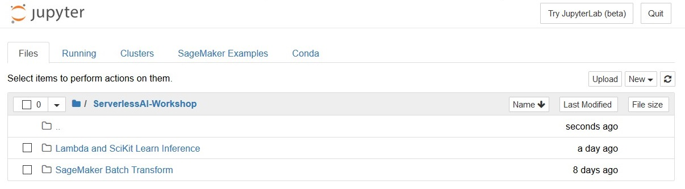
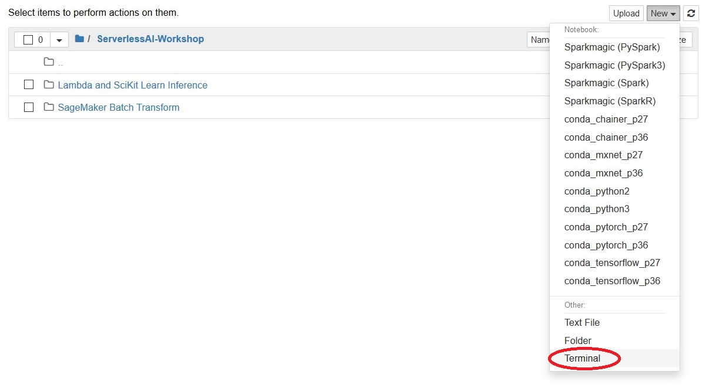
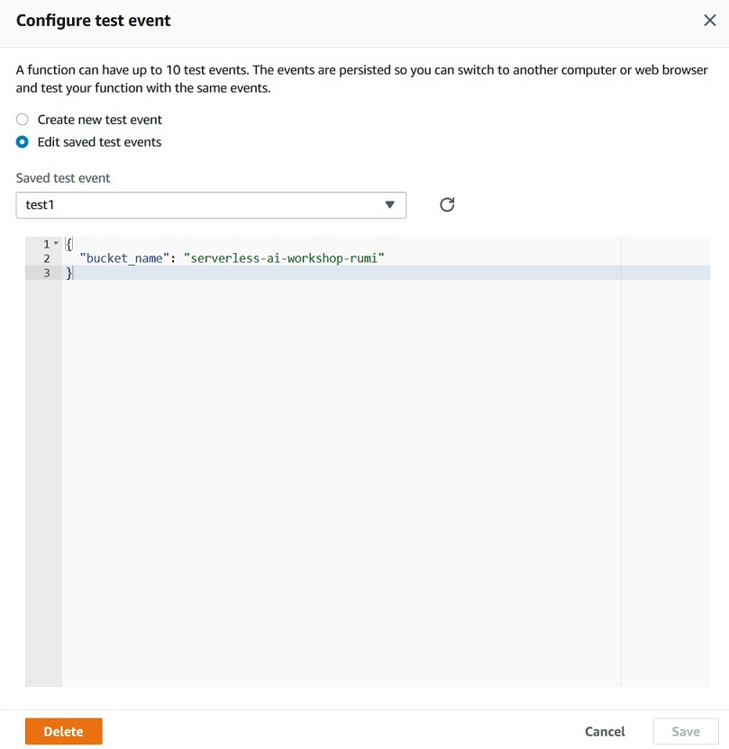

# Sentiment Analysis with Scikit Learn

In this workshop you will develop a simple sentiment analysis model using scikit learn's build-in linear regression algorithm. 

## Prerequisites

### AWS Account

In order to complete this workshop you'll need an AWS Account with access to S3, Lambda, SageMaker, and to create AWS IAM roles. The code and instructions in this workshop assume only one participant is using a given AWS account at a time. If you try sharing an account with another participant, you'll run into naming conflicts for certain resources. You can work around these by appending a unique suffix to the resources that fail to create due to naming conflicts. However, these instructions do not provide details on the changes required to make this work.

All of the resources you will launch as part of this workshop are eligible for the AWS free tier if your account is less than 12 months old. See the [AWS Free Tier page](https://aws.amazon.com/free/) for more details.

### Browser

We recommend you use the latest version of Firefox or Chrome to complete this workshop.

## Steps

1. Create lifecycle configuration  

	Login to the AWS Console and navigate to SageMaker. You can find SageMaker in the Machine Learning section or using the search box at the top of the console. The SageMaker Dashboard contains links to all major components. Second on the list is "Lifecycle configurations". Click on that link.
	
	Lifecycle configurations are startup scripts that initialize your Jupyter notebook environments. They can be run once on creation or on every notebook startup. 

	Click on the orange button labelled "Create Configuration". Under "Scripts" click on "Create notebook". Name the lifecycle configuration ```serverless-ai-workshop-lc```. Place your cursor on the line under the initial bash commands and paste the following: 

	```
	#!/bin/bash
	set -e
	
	cd SageMaker
	git clone https://github.com/aws-samples/serverless-ai-workshop.git
	
	mkdir ServerlessAI-Workshop
	mv "serverless-ai-workshop/Lambda and SciKit Learn Inference" ServerlessAI-Workshop/
	mv "serverless-ai-workshop/SageMaker Batch Transform" ServerlessAI-Workshop/
	mkdir "ServerlessAI-Workshop/Lambda and SciKit Learn Inference/LambdaPackage"
	mkdir "ServerlessAI-Workshop/SageMaker Batch Transform/LambdaPackage"
	mv "ServerlessAI-Workshop/Lambda and SciKit Learn Inference/lambda_function.py" "ServerlessAI-Workshop/Lambda and SciKit Learn Inference/LambdaPackage/lambda_function.py" 
	mv "ServerlessAI-Workshop/SageMaker Batch Transform/lambda_function.py" "ServerlessAI-Workshop/SageMaker Batch Transform/LambdaPackage/lambda_function.py" 
	
	chown -R ec2-user.ec2-user ServerlessAI-Workshop/
	rm -rf serverless-ai-workshop
	```

	The above commands do the following when the instance is created:
	- Download the code and necessary files from the workshop GitHub repo.
	- Organize the folder structure and place files in session folders.
	- Set write permission to the folders

1. Create a notebook instance from SageMaker console, using the lifecycle configuration created in the previous step

	
	
	- Take note of the region in which you are running SageMaker. You'll need to recall this region when you create an S3 bucket in the next step. 
	- Name the instance as ```serverless-ai-workshop```. 
	- Choose instance type such as ```ml.m4.4xlarge```. The "m" family is memory-optimized and "t" family is our least expensive general purpose instance class. 
	- Under IAM role choose "Create a new role"
		- Choose "Any S3 bucket" 
		- Click "Create role" and take note of the newly created role. 
	- No VPC
	- Choose lifecycle configuration, ```serverless-ai-workshop-lc``` 
	- No encryption

1. It takes about 3 minutes for a SageMaker notebook instance to start. While waiting for the notebook to be provisioned, create an S3 bucket with a globally unique name like ```serverless-ai-yourname```. Choose the same region as your SageMaker notebook. We recommend Oregon: ```us-west-2```. 

	This bucket is necessary to store the training data and models you're creating in this workshop. Take note of the region. SageMaker must be run in the same region as your newly created S3 bucket. If for any reason you choose an alternate region simply ensure that SageMaker runs in the same region as your newly created bucket.

1. To the IAM role SageMaker created in previous step, we need to add 2 additional policies, ```LambdaFullAccess``` and ```S3FullAccess```. These permissions are necessary because we will be uploading objects to S3 and creating Lambda functions from the notebook instance. 

 	
	
	- Navigate to IAM in the AWS Console. From the left navigation click on "Roles". 
	- On the seach box, type ```SageMaker```. The name of the role looks like ```AmazonSageMaker-ExecutionRole-20181022T083494``` 
	- On the Summary page, click on the Attach policies button.
	- Use the search box to add ```LambdaFullAccess```, ```S3FullAccess``` individually. You do this by searching, clicking on the on the checkbox, searching again, and selecting the next policy. Note that this is a highly permissive role that should not be used in production. It is only intended to facilitate learning in this workshop.
	- After you have added both policies click on Attach policy button.
	- Return to the SageMaker console. 

1. While we are on the IAM console, let us create Lambda's execution role. This role is for Lambda to have sufficient permissions to perform tasks such as getting objects from S3 and creating batch transform job. 

	- Navigate to IAM in the AWS Console. From the left navigation click on "Roles". Click on "Create Role".
	- From the list of AWS Services choose: Lambda. Click on Next:Permissions.
	- Use the search box to add ```LambdaFullAccess```, ```S3FullAccess```, and ```AmazonSageMakerFullAccess``` individually. You do this by searching, clicking on the on the checkbox, searching again, and selecting the next policy. Note that this is a highly permissive role that should not be used in production. It is only intended to facilitate learning in this workshop. 
	- After you have added all 3 policies click on Next:Review
	- For Role Name use Lambda_ServerlessWorkshop_Role.
	- Click on Create role.
	- Return to the SageMaker console. 

	 

1. Once the notebook instance is ready, open the instance by clicking "Open". Take moment to browse the folder structures created.

1. Go to the **ServerlessAI-Workshop/Lambda and SciKit Learn Inference** folder and open the notebook called, **Scikit-Learn-Sentiment-Analysis-Tweet.ipynb**. Take a moment to read the instructions and examine the code before proceeding to the next steps. If any cell is unclear please ask for help either in the workshop or at http://bit.ly/serverlessAI
	
	
		
1. In the notebook, do the following:
	- Replace ```<your-bucket-name>``` with the bucket name you created in the previous step.
	- Step through each cell and execute them. It will train the scikit-learn's built-in algorithm, logistic regression using tweets dataset. 
	- At the end of the notebook, there are lines of code to upload the trained model and validation/test data to the S3 bucket that you created in the previous step. 
	- Navigate back to the tab with your Jupyter notebook file browser. 

1. Open Terminal on the notebook instance. 

	

	To setup Lambda and enable inference on our newly created model we'll use the AWS command line interface. The AWS CLI is pre-installed in the bash shell provided in every SageMaker instance. On the right hand side of the Jupyter notebook click on "New". At the bottom of the pulldown menu select "Terminal".

	We'll use 7zip to compress our Lambda package, but first it must be installed. Run the following command on the terminal to install 7zip

	```
	conda install -y -c bioconda p7zip 
	```

1. Create Lambda deployment package on the notebook instance from terminal executing the following commands:
	```
	cd SageMaker/ServerlessAI-Workshop/Lambda\ and\ SciKit\ Learn\ Inference/LambdaPackage
	sudo pip install --ignore-installed --target=. sklearn
	find . -name "*.so" | xargs strip
	7z a -mm=Deflate -mfb=258 -mpass=15 -r ../SentimentAnalysis_Sklearn.zip *
	```
1. Upload the deployment package to your S3 bucket. Replace ```<your-bucket-name>``` with your S3 bucket name.

	```
	aws s3api put-object --bucket <your-bucket-name> --key ServerlessAIWorkshop/SentimentAnalysis/SentimentAnalysis_Sklearn.zip --body ../SentimentAnalysis_Sklearn.zip --region us-west-2
	```

1. Create a Lambda function using the deployment package stored in your S3 bucket. The required Lambda role was created earlier when we were waiting for our SageMaker instance to provision. You'll need the full Amazon Resource Name ("apn") to run the following command. You can find it by returning to IAM, searching for the role by name and clicking on it for full information. 
 
	```
	aws lambda create-function --function-name SentimentAnalysis_Sklearn --runtime python3.6 --role  arn:aws:iam::<your-aws-account>:role/<lambda-execution-role-name> --handler lambda_function.lambda_handler --memory-size 512 --timeout 60 --environment Variables={JOBLIB_MULTIPROCESSING=0} --code S3Bucket="<your-bucket-name>",S3Key="ServerlessAIWorkshop/SentimentAnalysis/SentimentAnalysis_Sklearn.zip" 
	```
	If you need to update the code, use the following command:
	
	```
	aws lambda update-function-code --function-name SentimentAnalysis_Sklearn --s3-bucket <your-bucket-name> --s3-key ServerlessAIWorkshop/SentimentAnalysis/SentimentAnalysis_Sklearn.zip
	```
1. On the Lambda console, create a test event with the following JSON. 

	Your package has been uploaded and instantiated. Now you can call it on demand. We'll use Lambda's testing feature to call the model. Lambda is in the Compute section of the console. Navigate to Lambda from the console, click on Functions, and select: ```SentimentAnalysis_Sklearn```. In the upper right corner of the screen click on "Test". A popupp called "Configure test event" will appear. Enter your bucket name as event data. You'll need to name the event as well. 

	```
	{
	  "bucket_name": "<your-bcuket-name>" 
	}
	```
	
	

## Congratulations!

You've successfully created a model using scikit-learn, built a Lambda deployment package, installed the package, and run the function on demand interactively from the console. This model is now available for use at scale. You may choose to call the function from API Gateway to put it into production. That's an exercise for outside of this workshop. 

## Cleanup
After you have completed the workshop you can delete all of the resources that were created in the following order.

1. Stop the SageMaker notebook instance.

That's it for scikit-learn. Next we'll learn how to overcome Lambda's constraints by using SageMaker's Batch Transform feature.